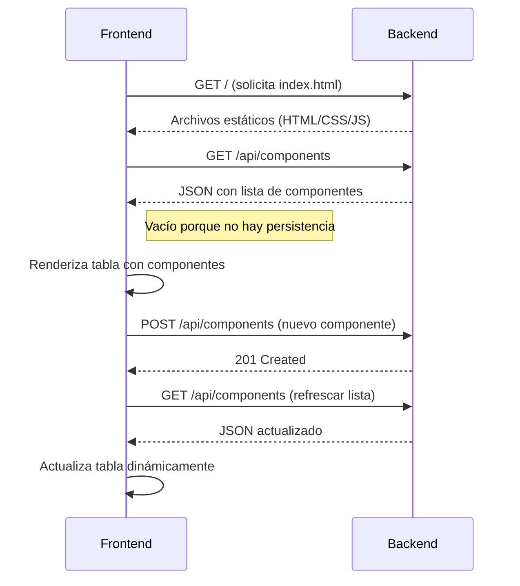

# Arquitecturas empresariales - Taller 1 

Este proyecto implementa un servidor web en Java que maneja múltiples solicitudes de manera secuencial (no concurrente). El servidor es capaz de leer archivos del disco local y devolver cualquier archivo solicitado, incluyendo páginas HTML, archivos JavaScript, CSS e imágenes. Implementa uuna arquitectura de servidow web sencillo basado en java, donde el servidor HTTP básico se ejecuta, acepta solicitudes de clientes, las procesa y envía las respuestas.

---

## Capturas de pantalla de la aplicación

La aplicación web funciona como una lista para guarda los libros, películas y series que el usuario haya visto y quiera guardar para futuros recuerdos, puede añadir una descripción y una calificación.


Puede especificar si es un libro, película o serie.


En la opción de Network de la herramienta de inspección del navegador podemos observar que hace un post al endpoint /api/components para crear el componente.


Y justo después hce un get a /api/components y recibe la información del componente en formato json


---

## Estructura de archivos del proyecto

```bash
.
├── .mvn/                    # Configuración de Maven Wrapper
├── public/                  # Archivos estáticos accesibles desde el navegador
│   ├── images/              # Carpeta con imágenes usadas en la aplicación y en el readme 
│   ├── app.js               # Lógica del lado del cliente en JavaScript
│   ├── index.html           # Página principal de la aplicación
│   └── styles.css           # Hojas de estilo para dar diseño a la interfaz           
├── src/                     # Código fuente y pruebas
│   ├── main/                # Código principal
│   │   ├── java/                 
│   │   │   └── com/
│   │   │       └── arep/
│   │   │           └── Component.java    # Clase modelo para representar un componente
│   │   │           └── HttpServer.java   # Clase principal del servidor
│   └── test/                             # Código de pruebas unitarias
│       └── java/
│           └── com/
│               └── arep/
│                   └── ComponentTest.java
│                   └── HttpServerIntegrationTest.java
│                   └── HttpServerTest.java
├── target/                       # Archivos compilados y empaquetados (generado por Maven)
├── pom.xml                       # Configuración de Maven (dependencias y build)
└── README.md
```

---

## Arquitectura del proyecto


**Backend (Servidor Java)**


El backend está compuesto por un servidor HTTP implementado en Java que:

- Utiliza ServerSocket para escuchar en el puerto 35000
- Maneja dos tipos de solicitudes:
  - Archivos estáticos: Sirve recursos (HTML, CSS, JS, imágenes) desde la carpeta public/
  - API REST: Expone endpoints en /api/components con:

    - GET /api/components → Devuelve todos los componentes en formato JSON
    - POST /api/components → Agrega un nuevo componente (recibe JSON en el cuerpo)


Características clave:

Manejo de JSON: Implementa parser personalizado para solicitudes POST
Tipos MIME: Detecta automáticamente content-type para archivos estáticos
Almacenamiento: Mantiene componentes en memoria (lista static)


**Frontend (Aplicación Web)**

Interfaz construida con:

- index.html: Estructura principal con formulario y tabla para mostrar los componentes.
- styles.css: Estilos visuales.
- app.js: Lógica de cliente que comunica con el API usando fetch(), maneja eventos del formulario y actualiza dinámicamente la tabla de componentes



---

## Ejecutando el proyecto

Estas instrucciones permiten obtener una copia del proyecto en funcionamiento en la máquina local para desarrollo y pruebas.

El servidor se implementa utilizando sockets en Java y gestiona solicitudes GET y POST para obtener y agregar componentes a través de una API REST básica sin hacer uso de frameworks como spring.

### Pre-requisitos

Para ejecutar este proyecto necesitas instalar lo siguiente:

- Java 17 o superior
- Maven 3.8.1 o superior (la versión en el entorno donde fue creado es la 3.9.9)
- Un navegador web
  
En caso de no tener maven instalado, aquí se encuentra un tutorial [Instalación de Maven](https://es.stackoverflow.com/questions/65317/como-instalar-maven-en-windows). 

### Instalación

Siga estos pasos para obtener un entorno de desarrollo funcional:

Clone este repositorio:

```bash
git clone https://github.com/AnaDuranB/Taller-01-AREP.git
```

Ingrese al directorio del proyecto:

```bash
cd Taller1-AREP
```

Compile el proyecto con Maven:

```bash
mvn clean compile
```

Y ejecute el servidor:

```bash
java -cp target/classes com.arep.HttpServer
```


Abra su navegador y acceda a:

```bash
http://localhost:35000/index.html
```

---

## Pruebas

Para ejecutar las pruebas automatizadas use este comando de maven:

```bash
mvn test
```

Resultados esperados:

```bash
[INFO] -------------------------------------------------------
[INFO]  T E S T S
[INFO] -------------------------------------------------------
[INFO] Running com.arep.ComponentTest
[INFO] Tests run: 2, Failures: 0, Errors: 0, Skipped: 0, 
Time elapsed: 0.052 s -- in com.arep.ComponentTest
[INFO] Running com.arep.HttpServerIntegrationTest
[INFO] Tests run: 2, Failures: 0, Errors: 0, Skipped: 0, 
Time elapsed: 0.504 s -- in com.arep.HttpServerIntegrationTest
[INFO] Running com.arep.HttpServerTest
[INFO] Tests run: 4, Failures: 0, Errors: 0, Skipped: 0, 
Time elapsed: 0.009 s -- in com.arep.HttpServerTest
[INFO] 
[INFO] Results:
[INFO]
[INFO] Tests run: 8, Failures: 0, Errors: 0, Skipped: 0
[INFO]
[INFO] --------------------------------------------------------
[INFO] BUILD SUCCESS
[INFO] --------------------------------------------------------
[INFO] Total time:  2.589 s
[INFO] Finished at: 2025-08-18T22:07:40-05:00
[INFO] --------------------------------------------------------
```

---

## Despliegue

Para desplegar este servidor en un sistema en producción.

Empaquete el proyecto en un JAR ejecutable:

```bash
mvn clean package
```

Ejecute el JAR generado:

```bash
java -jar target/taller1-arep-1.0-SNAPSHOT.jar 
```

---

## Herramientas usadas

- Java SE – Lenguaje de programación orientado a objetos para aplicaciones de propósito general.
- Maven – Herramienta de gestión de dependencias y automatización de la construcción de proyectos Java.
- HTML5 – Lenguaje de marcado estándar para estructurar el contenido de páginas web.
- JavaScript – Lenguaje de programación que permite crear interactividad y lógica en aplicaciones web del lado del cliente (y también del servidor con Node.js).
- CSS – Lenguaje de estilos que define la presentación y diseño visual de documentos HTML.

---

## Autor

Juan José Díaz - [github](https://github.com/Juan-Jose-D)

Escuela Colombiana de ingeniería Julio Garavito


