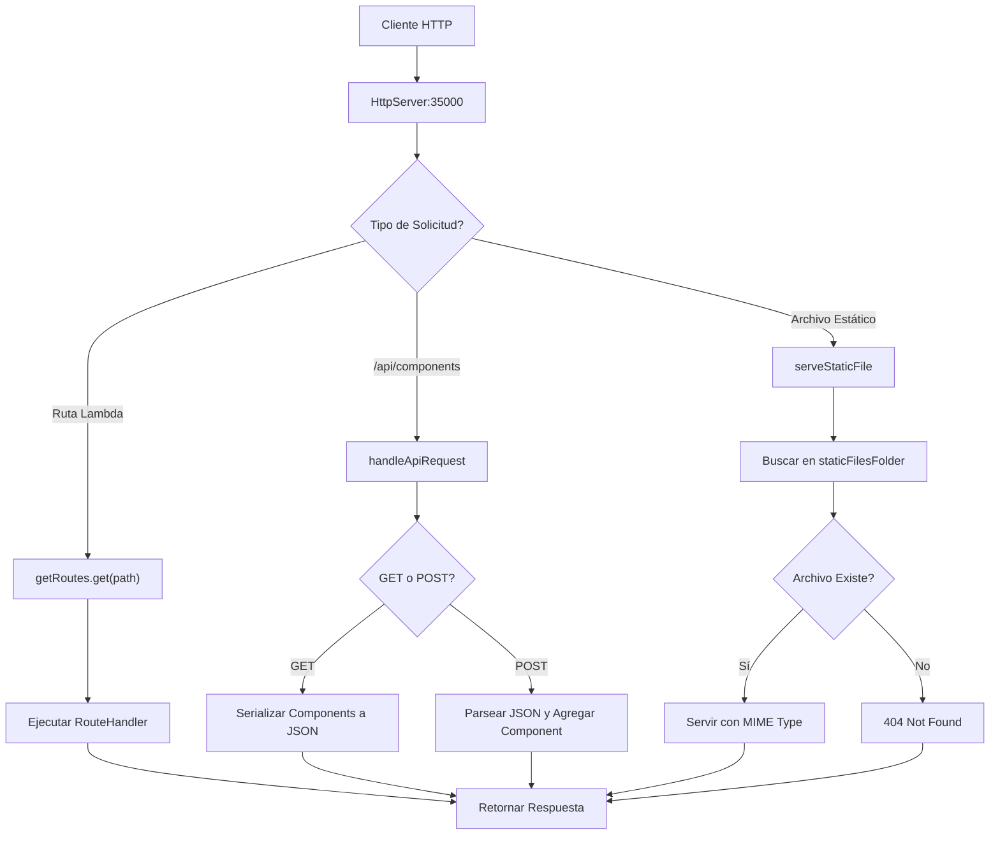

# Arquitecturas empresariales - Taller 2

[](https://www.oracle.com/java/)
[](https://maven.apache.org/)

Este proyecto tiene como objetivo transformar un servidor web básico en un framework web completamente funcional, permitiendo a los desarrolladores construir aplicaciones web modernas con servicios REST en el backend. El framework proporciona herramientas para definir servicios REST mediante funciones lambda, gestionar parámetros de consulta en las solicitudes y especificar la ubicación de archivos estáticos.

---


## Características Principales

1. **Definición de Servicios REST con Lambdas**
  - Permite definir rutas REST de manera simple y elegante utilizando expresiones lambda:
  - Ejemplo:
    ```java
    get("/App/hello", (req, res) -> "hello world!");
    get("/pi", (req, res) -> String.valueOf(Math.PI));
    ```
Esto facilita la creación de rutas claras y concisas, mapeando URLs a funciones específicas.

2. **Extracción de Parámetros de Consulta**
  - El framework parsea automáticamente los query parameters y los expone através del objeto Request:
  - Ejemplo:
    ```java
    // URL: /hello?name=Pedro&age=25
    get("/hello", (req, res) -> {
        String name = req.getValues("name"); // "Pedro"
        String age = req.getValues("age");   // "25"
        return "Hello " + name + ", you are " + age + " years old";
    });
    ```
Permite construir servicios dinámicos y personalizados de forma sencilla.

3. **Especificación de Ubicación de Archivos Estáticos**
  - Mediante el método `staticfiles()`, los desarrolladores pueden definir la carpeta donde se encuentran los archivos estáticos.
  - Ejemplo:
    ```java
    staticfiles("public");
    ```
  - El framework buscará archivos como HTML, CSS, JS e imágenes en la carpeta especificada, facilitando la organización de recursos.

4. **Manejo Automático de Tipos MIME**
Detecta y sirve automáticamente diferentes tipos de archivos:

- HTML, CSS, JavaScript
- Imágenes (PNG, JPG)
- Respuestas JSON para APIs

---

## Arquitectura del Framework

El núcleo de este proyecto es la clase `HttpServer`, que implementa un framework web en Java puro. Este framework permite a los desarrolladores definir servicios REST y servir archivos estáticos de manera sencilla, sin depender de frameworks externos.

### Componentes Principales

- **HttpServer (Núcleo del Framework):**
  - Implementa `ServerSocket` para escuchar en el puerto **35000**.
  - Maneja **routing** mediante `HashMap<String, RouteHandler>`.
  - Procesa solicitudes HTTP de forma **síncrona**.
  - Integra un **mini-framework** para definición de rutas.

- **Clases del Mini-Framework:**
  - `RouteHandler`: Interfaz funcional para handlers de rutas.
  - `Request`: Encapsula información de la solicitud (path, query params).
  - `Response`: Placeholder para futuras extensiones de respuesta.

- **Component API:**
  - Modelo de datos para gestión de componentes.
  - Almacenamiento en memoria temporal con `List<Component>`.
  - Serialización JSON manual.

### Estructura General

- **Definición de rutas REST:**
  Se utiliza el método `get(String path, RouteHandler handler)` para mapear rutas a funciones lambda que procesan las solicitudes.

- **Manejo de parámetros de consulta:**
  Los parámetros de la URL se extraen automáticamente y se pueden acceder desde el objeto `Request` dentro de cada handler.

- **Archivos estáticos:**
  El método `staticfiles(String folder)` permite especificar la carpeta raíz de los archivos estáticos.

### Ejemplo de Configuración de Rutas

En la primera parte del método `main` se configuran las rutas y la carpeta de archivos estáticos.  

```java
public static void main(String[] args) {
    staticfiles("/public");
    get("/App/hello", (req, res) -> "Hello " + req.getValues("name"));
    get("/App/pi", (req, res) -> String.valueOf(Math.PI));
    HttpServer.main(args); 
}
```
### Flujo de Procesamiento de Solicitudes



---
## Estructura de archivos del proyecto

```bash
.
├── .mvn/                    # Configuración de Maven Wrapper
├── public/                  # Archivos estáticos accesibles desde el navegador
│   ├── images/              # Carpeta con imágenes usadas en la aplicación y en el readme 
│   ├── app.js               # Lógica del lado del cliente en JavaScript
│   ├── index.html           # Página principal de la aplicación
│   ├── clase.html           # Página web sencilla hecha en clase
│   └── styles.css           # Hojas de estilo para dar diseño a la interfaz           
├── src/                     # Código fuente y pruebas
│   ├── main/                # Código principal
│   │   ├── java/                 
│   │   │   └── com/
│   │   │       └── arep/
│   │   │           └── Component.java    # Clase modelo para representar un componente
│   │   │           └── HttpServer.java   # Clase principal del servidor
│   │   │           └── clase/            # Archivos creados en las clases de laboratorio
│   └── test/                             # Código de pruebas unitarias
│       └── java/
│           └── com/
│               └── arep/
│                   └── ComponentTest.java
│                   └── HttpServerIntegrationTest.java
│                   └── HttpServerTest.java
├── target/                       # Archivos compilados y empaquetados (generado por Maven)
├── pom.xml                       # Configuración de Maven (dependencias y build)
└── README.md
```

---


## Capturas de pantalla de la aplicación

La aplicación web funciona como una lista para guarda los libros, películas y series que el usuario haya visto y quiera guardar para futuros recuerdos, puede añadir una descripción y una calificación.


Puede especificar si es un libro, película o serie.


En la opción de Network de la herramienta de inspección del navegador podemos observar que hace un post al endpoint /api/components para crear el componente.


Y justo después hce un get a /api/components y recibe la información del componente en formato json


---


## Ejecutando el proyecto

Estas instrucciones permiten obtener una copia del proyecto en funcionamiento en la máquina local para desarrollo y pruebas.


### Pre-requisitos

Para ejecutar este proyecto necesitas instalar lo siguiente:

- Java 17 o superior
- Maven 3.8.1 o superior (la versión en el entorno donde fue creado es la 3.9.9)
- Un navegador web
  
En caso de no tener maven instalado, aquí se encuentra un tutorial [Instalación de Maven](https://es.stackoverflow.com/questions/65317/como-instalar-maven-en-windows). 

### Instalación

Siga estos pasos para obtener un entorno de desarrollo funcional:

Clone este repositorio:

```bash
git clone https://github.com/Juan-Jose-D/Taller2-AREP.git
```

Ingrese al directorio del proyecto:

```bash
cd Taller2-AREP
```

Compile el proyecto con Maven:

```bash
mvn clean compile
```

Y ejecute el servidor:

```bash
java -cp target/classes com.arep.HttpServer
```


Abra su navegador y acceda a alguna de las rutas:

```bash
# Páginas estáticas
http://localhost:35000/index.html
http://localhost:35000/clase.html
# Funciones
http://localhost:35000/App/hello?name=Juan
http://localhost:35000/App/pi
```

---

## Pruebas

Para ejecutar las pruebas automatizadas use este comando de maven:

```bash
mvn test
```

Resultados esperados:

```bash
[INFO] -------------------------------------------------------
[INFO]  T E S T S
[INFO] -------------------------------------------------------
[INFO] Running com.arep.ComponentTest
[INFO] Tests run: 2, Failures: 0, Errors: 0, Skipped: 0, 
Time elapsed: 0.052 s -- in com.arep.ComponentTest
[INFO] Running com.arep.HttpServerIntegrationTest
[INFO] Tests run: 2, Failures: 0, Errors: 0, Skipped: 0, 
Time elapsed: 0.504 s -- in com.arep.HttpServerIntegrationTest
[INFO] Running com.arep.HttpServerTest
[INFO] Tests run: 4, Failures: 0, Errors: 0, Skipped: 0, 
Time elapsed: 0.009 s -- in com.arep.HttpServerTest
[INFO] 
[INFO] Results:
[INFO]
[INFO] Tests run: 8, Failures: 0, Errors: 0, Skipped: 0
[INFO]
[INFO] --------------------------------------------------------
[INFO] BUILD SUCCESS
[INFO] --------------------------------------------------------
[INFO] Total time:  2.589 s
[INFO] Finished at: 2025-08-18T22:07:40-05:00
[INFO] --------------------------------------------------------
```

---

## Despliegue

Para desplegar este servidor en un sistema en producción.

Empaquete el proyecto en un JAR ejecutable:

```bash
mvn clean package
```

Ejecute el JAR generado:

```bash
java -jar target/taller1-arep-1.0-SNAPSHOT.jar 
```

---

## Herramientas usadas

- Java SE – Lenguaje de programación orientado a objetos para aplicaciones de propósito general.
- Maven – Herramienta de gestión de dependencias y automatización de la construcción de proyectos Java.
- HTML5 – Lenguaje de marcado estándar para estructurar el contenido de páginas web.
- JavaScript – Lenguaje de programación que permite crear interactividad y lógica en aplicaciones web del lado del cliente (y también del servidor con Node.js).
- CSS – Lenguaje de estilos que define la presentación y diseño visual de documentos HTML.

---

## Autor

Juan José Díaz - [github](https://github.com/Juan-Jose-D)

Escuela Colombiana de ingeniería Julio Garavito


